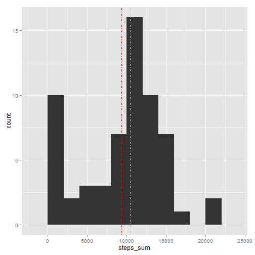
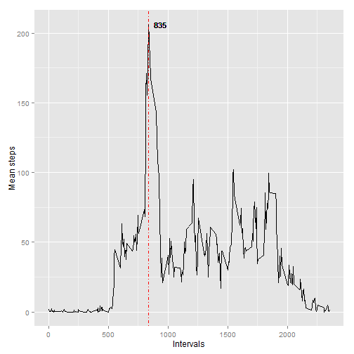
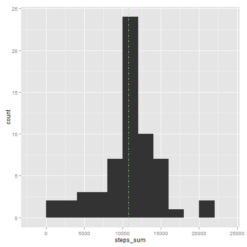
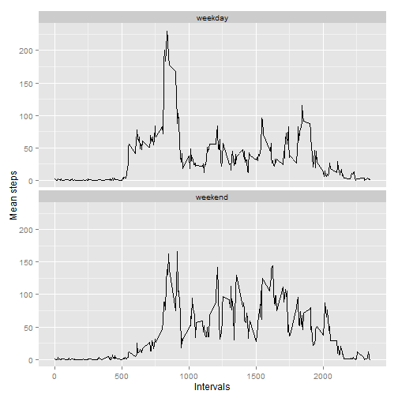

## Loading libraries

```r
library(readr)
library(dplyr)
library(ggplot2)
```

## Loading and preprocessing the data

```r
activity.data <- read_csv(unz("activity.zip", "activity.csv"), col_type = "iDi")
str(activity.data)
```

```
## Classes 'tbl_df', 'tbl' and 'data.frame':	17568 obs. of  3 variables:
##  $ steps   : int  NA NA NA NA NA NA NA NA NA NA ...
##  $ date    : Date, format: "2012-10-01" "2012-10-01" ...
##  $ interval: int  0 5 10 15 20 25 30 35 40 45 ...
```

## What is mean total number of steps taken per day?


```r
steps_per_day <-
  activity.data %>% 
  group_by(date) %>%
  summarise(
    steps_sum = sum(steps, na.rm = TRUE)
  )

steps_per_day_mean <- mean(steps_per_day$steps_sum)
steps_per_day_median <- median(steps_per_day$steps_sum)

ggplot(steps_per_day, aes(x = steps_sum)) +
  geom_histogram(binwidth = 2000) +
  geom_vline(aes(xintercept = steps_per_day_mean), color = "red", linetype = "dotdash") +
  geom_vline(aes(xintercept = steps_per_day_median), color = "lightgreen", linetype = "dotdash")
```

 

Report the mean and median of the total number of steps taken per day:

```r
steps_per_day_mean
```

```
## [1] 9354.23
```

```r
steps_per_day_median
```

```
## [1] 10395
```


## What is the average daily activity pattern?


```r
steps_by_interval <-
  group_by(activity.data, interval) %>%
  summarise(
    steps_mean = mean(steps, na.rm = TRUE)
  )

interval_max <- filter(steps_by_interval, steps_mean == max(steps_mean))

ggplot(steps_by_interval, aes(x = interval, y = steps_mean)) +
  geom_line() +
  geom_text(aes(x = interval_max$interval+100, y = interval_max$steps_mean, 
                label = interval_max$interval), size = 4) +
  geom_vline(aes(xintercept = interval_max$interval), color = "red", linetype = "dotdash") +
  labs(x = "Intervals", y = "Mean steps") 
```

 

Which 5-minute interval, on average across all the days in the dataset, contains the maximum number of steps?


```r
interval_max$interval
```

```
## [1] 835
```


## Imputing missing values

Calculate and report the total number of missing values in the dataset:

```r
nrow(filter(activity.data, is.na(steps)))
```

```
## [1] 2304
```

Create a new dataset that is equal to the original dataset but with the missing data filled in:

```r
activity.data2 <- left_join(activity.data, steps_by_interval, by = "interval")

activity.data2 <-
  activity.data2 %>%
  mutate(steps = ifelse(is.na(steps), steps_mean, steps)) %>%
  select(-steps_mean)

steps_per_day_new <-
  activity.data2 %>%
  group_by(date) %>%
  summarise(
    steps_sum = sum(steps, na.rm = TRUE)
  )

steps_per_day_mean2 <- mean(steps_per_day_new$steps_sum)
steps_per_day_median2 <- median(steps_per_day_new$steps_sum)

ggplot(steps_per_day_new, aes(x = steps_sum)) +
  geom_histogram(binwidth = 2000) +
  geom_vline(aes(xintercept = steps_per_day_mean2), color = "red", linetype = "dotdash") +
  geom_vline(aes(xintercept = steps_per_day_median2), color = "lightgreen", linetype = "dotdash")
```

 

The impact of imputation: 

```r
steps_per_day_mean2
```

```
## [1] 10766.19
```

```r
steps_per_day_median2
```

```
## [1] 10766.19
```


## Are there differences in activity patterns between weekdays and weekends?

Create a new factor variable in the dataset with two levels - "weekday" and "weekend" indicating whether a given date is a weekday or weekend day:

```r
activity.data2 <- 
  activity.data2 %>%
  mutate(day = ifelse(is.element(weekdays(date), c("Saturday", "Sunday")), "weekend", "weekday"))
```

Make a panel plot containing a time series plot:

```r
steps_by_interval_new <-
  activity.data2 %>% 
  group_by(day, interval) %>%
  summarise(
    steps_mean = mean(steps)
  )


ggplot(steps_by_interval_new, aes(x = interval, y = steps_mean)) +
  geom_line() +
  facet_wrap( ~ day, ncol = 1) +
  labs(x = "Intervals", y = "Mean steps") 
```

 
